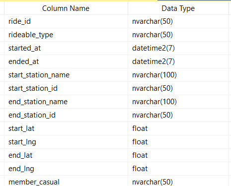
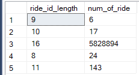
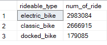

# Google Data Analytics Capstone: Cyclistic Case Study 1

## Introduction

In this case study, I performed many real-world tasks of a junior data analyst working for fictional company, Cyclistic. In order to answer the key business questions, I meticulously followed the steps of the data analysis process which include ask, prepare, process, analyze, share, and act.

## Links
Data Source: <a href="https://divvy-tripdata.s3.amazonaws.com/index.html">Divvy_TripData</a>

SQL Queries

<a href="https://github.com/GloriaOlaleye/gloriaolaleye.github.io/blob/main/Cyclistic%20%20tripdata%20exploration.sql">Data Exploration</a>

<a href="https://github.com/GloriaOlaleye/gloriaolaleye.github.io/blob/main/Cyclistic%20tripdata%20Cleaning.sql">Data Cleaning and Analysis</a>

 Data Visualization

<a href="https://public.tableau.com/app/profile/gloria.olaleye/viz/CyclisticTripdataDashboard/Dashboard2?publish=yes">TABLEAU</a>

## Background about the company

In 2016, Cyclistic launched a successful bike-share offering. Since then, the program has grown to a fleet of 5,824 bicycles that are geotracked and locked into a network of 692 stations across Chicago. The bikes can be unlocked from one station and returned to any other station in the system anytime.
Until now, Cyclistic’s marketing strategy relied on building general awareness and appealing to broad consumer segments. One approach that helped make these things possible was the flexibility of its pricing plans: single-ride passes, full-day passes, and annual memberships. Customers who purchase single-ride or full-day passes are referred to as casual riders. Customers who purchase annual memberships are Cyclistic members.
Cyclistic’s finance analysts have concluded that annual members are much more profitable than casual riders. Although the pricing flexibility helps Cyclistic attract more customers, Moreno believes that maximizing the number of annual members will be key to future growth. Rather than creating a marketing campaign that targets all-new customers, Moreno believes there is a very good chance to convert casual riders into members. She notes that casual riders are already aware of the Cyclistic program and have chosen Cyclistic for their mobility needs.
Moreno has set a clear goal: Design marketing strategies aimed at converting casual riders into annual members. In order to do that, however, the marketing analyst team needs to better understand how annual members and casual riders differ, why casual riders would buy a membership, and how digital media could affect their marketing tactics. Moreno and her team are interested in analyzing the Cyclistic historical bike trip data to identify trends.

## Scenario

I assume the position of aa junior data analyst working in the marketing analyst team at Cyclistic, a bike-share company in Chicago. The director of marketing believes the company’s future success depends on maximizing the number of annual memberships. My team and I want to understand how casual riders and annual members use Cyclistic bikes differently. From these insights, my team will design a new marketing strategy to convert casual riders into annual members. Cyclistic executives must first approve our recommendations, so they must be backed up with compelling data insights and professional data visualizations.

## Ask

### Business Goal

Design marketing strategies aimed at converting casual riders into annual members.

Three questions will guide the future marketing program:

1. How do annual members and casual riders use Cyclistic bikes differently?
2. Why would casual riders buy Cyclistic annual memberships?
3. How can Cyclistic use digital media to influence casual riders to become members?

## Prepare

I used Cyclistic’s historical trip data to analyze and identify trends. I used the data from Apri, 2022 to March, 2023 downloaded <a href="https://divvy-tripdata.s3.amazonaws.com/index.html">here.</a> The data has been made available by Motivate International Inc. under this <a href="https://ride.divvybikes.com/data-license-agreement">license.</a> This is public data that you can use to explore how different customer types are using Cyclistic bikes. But note that data-privacy issues prohibit you from using riders’ personally identifiable information. This means that you won’t be able to connect pass purchases to credit card numbers to determine if casual riders live in the Cyclistic service area or if they have purchased multiple single passes.

### Data Organization
There are 12 files with naming convention of YYYYMM-divvy-tripdata and each file includes information for each month with colunmn headers including ride_id, rideable_type, started_at, ended_at, start_station_name, start_station_id, end_station_name, end_station_id, start_lat, start_lng, end_lat, end_lng and member_casual.

## Process

SQL server management studio was used to combine the various datasets into one dataset and clean it. This is because the volume in each month dataset cannot be acccomodated as the rows exceed the capacity of Microsoft Excel as well Google Sheets. SQL server is a database platform that can accomodate millions of rows of data.
I combined and explored the data in SQL server management studio. The query used can be found <a href="https://github.com/GloriaOlaleye/gloriaolaleye.github.io/blob/main/Cyclistic%20%20tripdata%20exploration.sql">here.</a>

Observations:

1. The primary key is the ride_id column. The table below shows column names as well as their data types.

    .
   
3. The ride_id column has 5,828,894 rows with 16 characters, 143 rows with 11 characters, 24 rows with 8 characters, 17 rows with 10 charaters and 6 rows with 9 characters. All of the ride_id are distinct.

    .

4. There are 3 distict ride types; electric_bikes, classic_bikes and docked_bikes.
 
    

 5. The started_at and ended_at shows start time and end time of the trip in YYYY-MM-DD hh:mm:ss format. There were 180,776 trips with ride duration less than one minute, greater than one day or having end time earlier than start time.

  

